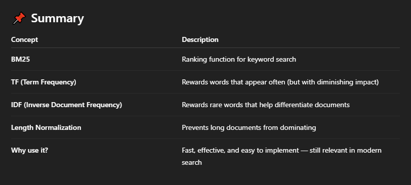

🔍 What is BM25?
----------------

**BM25** stands for **Best Matching 25**. It's a **ranking algorithm** used in search engines to find how **relevant** a document is to a given query.

*   ✅ It’s **not** a neural network or embedding model.
    
*   ✅ It’s based on **simple statistics** (Term Frequency and Inverse Document Frequency).
    
*   ✅ It’s been widely used since the 1990s and is still a **strong baseline** for keyword-based search.
    

🧠 How does it work?
--------------------

BM25 scores a document based on **three main ideas**:

### 1\. **Term Frequency (TF)**

Words that appear more often in a document are usually more important.

*   📌 But: just because a word appears 10 times doesn’t mean the document is 10× more relevant.
    
*   👉 BM25 uses **diminishing returns**: the more times a word appears, the less extra value each repetition adds.
    

### 2\. **Inverse Document Frequency (IDF)**

Rare words are more informative than common ones.

*   A word like "distributed" might appear in fewer documents and is thus **more meaningful** than "data", which shows up everywhere.
    
*   So, BM25 gives **higher scores** to documents with **rare terms** that match the query.
    

### 3\. **Document Length Normalization**

Longer documents naturally contain more words, so they might match more queries just because of their size.

*   BM25 **penalizes very long documents** so that they don’t unfairly rank higher.
    
*   This keeps things fair between short and long documents.
    

💡 Why use BM25?
----------------

*   ⚡ **Very fast and lightweight**: No machine learning training required.
    
*   🧪 **Great for exact keyword matching**, especially on small or medium datasets.
    
*   📊 **Used as a baseline** in many search/retrieval benchmarks.
    

Even with the rise of dense embedding models (BERT, OpenAI embeddings), BM25 is often **competitive or better** for exact-match or short queries.

🛠️ How will we use it?
-----------------------

In your case, you're using **FastEmbed**, which provides an easy way to try BM25 without writing everything from scratch.

> You’ll use it to create **sparse embeddings** of your documents and perform search/retrieval based on BM25 scoring.
>
>