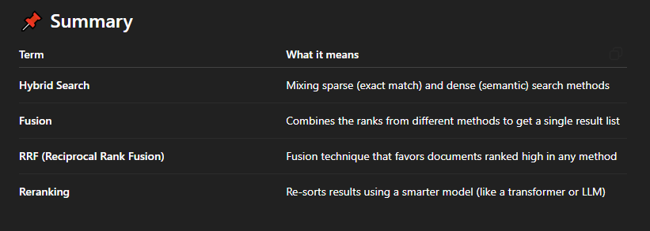

🧠 What is **Hybrid Search**?
-----------------------------

**Hybrid Search** means **combining multiple search methods** — usually:

*   **Sparse search** (based on exact words — like BM25)
    
*   **Dense search** (based on meaning — like embeddings from BERT)
    

💡 Why use both?Because **you don’t know in advance what kind of queries your users will ask**:

*   Some users might type **keywords** → works best with **sparse search**.
    
*   Others might ask full **natural language questions** → works best with **dense search**.
    

So, combining both gives you the **best of both worlds**.

🔁 But how do we **combine the results**?
-----------------------------------------

That’s the **real challenge** in Hybrid Search:

*   **BM25** gives one kind of score (sparse).
    
*   **Embeddings** give a completely different kind of score (dense).
    
*   These scores **aren’t directly comparable**, because they’re on different scales.
    

So we need to **merge or reorder** the results in a smart way.

💡 Two key techniques used in Hybrid Search
-------------------------------------------

### 1\. **Fusion**

Fusion is about **combining the rankings or scores** from different search methods.

👉 The most popular fusion method is:

#### 🔄 **Reciprocal Rank Fusion (RRF)**

This method works as follows:

*   It looks at **how highly ranked** a document is in each method (not the raw score).
    
*   The higher it is ranked, the **higher the weight** it gets.
    
*   Even if a document is ranked well by just one method, it can still appear in the final results.
    

🧠 Why is this useful?Because you don’t need to normalize the scores — you're just working with ranks.

> **Rough intuition:**
> 
> *   If doc A is ranked #1 by sparse and #5 by dense → high final score.
>     
> *   If doc B is ranked #50 by both → low final score.
>     

💬 You won’t manually implement this — tools like **Qdrant** already do it for you automatically.

### 2\. **Reranking**

Once you get a combined set of results (from both methods), you can use a **reranker** (usually a powerful language model) to:

*   Re-analyze the top results,
    
*   And **reorder them** based on semantic relevance to the original query.
    

💡 This is helpful when:

*   You want the **final ordering** to be as accurate as possible,
    
*   And you're okay with adding a bit of computational cost.
  

